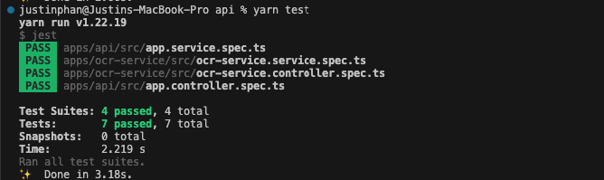
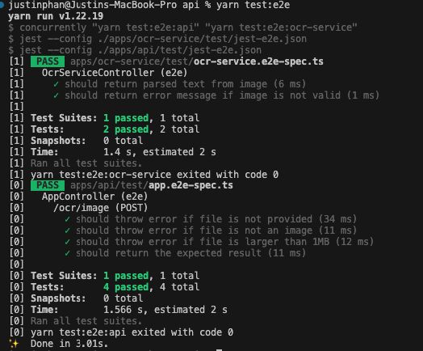

# Xtracta coding challenge

This project is a web application that utilizes NestJS for the API backend and ReactJS for the client-side frontend.

#### [Link Demo](https://www.loom.com/share/6b57f52a740243cfa7fb797e5f789fd1)

## Installation

### Prerequisites

To run this project, you need to have the following software installed on your machine:

- Node.js (version 18.15 or higher)
- Yarn (version 1.22 or higher)

#### Installing the API

1. Clone the repository to your local machine.
2. Open a terminal and navigate to the api folder in the project directory.

```bash
cd api
```

3. Install the project dependencies using yarn.

```bash
yarn install
```

4. Create a .env file in the api folder and set the environment variables. You can copy the .env.example file and modify it accordingly.

```bash
cp .env.example .env
```

5. Run the API server.

```bash
yarn start
```

This will start the API server at http://localhost:3000

#### Installing the client

1. Open a new terminal window and navigate to the client folder in the project directory.

```bash
cd client
```

2. Install the project dependencies using yarn.

```bash
yarn install
```

3. Start the client server.

```bash
yarn dev
```

This will start the client server at http://localhost:5173.

## Usage

Once the API and client servers are running, you can access the web application by opening your web browser and navigating to http://localhost:5173.

## Testing

#### Unit Tests

To run the unit tests for the API, run the following command in the `api` folder:

```bash
yarn test
```



#### End-to-end Tests

To run the e2e tests for the API, run the following command in the `api` folder:

```bash
yarn test:e2e
```


